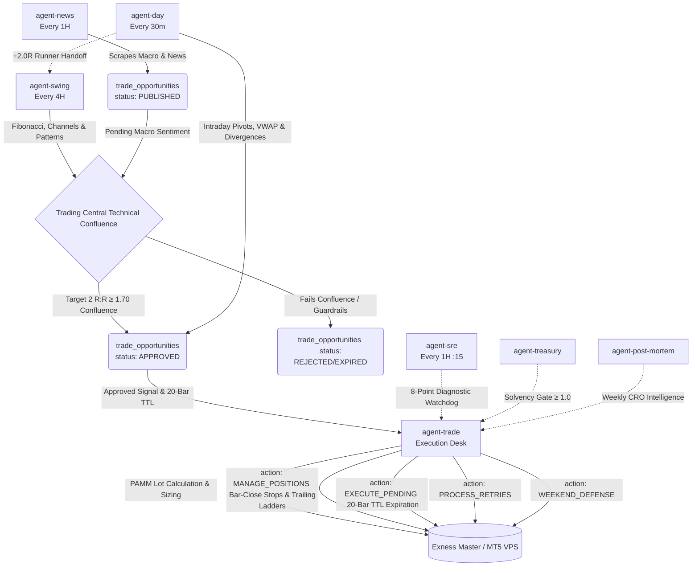

# Multi-Agent AI Trading Architecture
## RaineInvest — Optimum Agent Council Design (Enhanced with Trading Central Methodology)

---

## The Core Architecture

The RaineInvest automated trading system operates via a highly decoupled, multi-agent council. Rather than one monolithic AI making impulsive decisions, we employ specialized agents that handle distinct layers of the trade lifecycle (Macro Sentiment, Technical Confluence, Risk & Execution, and Position Management). 

The agents communicate exclusively through a shared intelligence layer (the `trade_opportunities`, `market_context`, and `user_trades` tables). No agent places a trade directly in the broker without the consensus of the council.

### Zero-Latency MT5 VPS Execution
The actual trade execution and data pushing is handled by the **Zero-Latency MT5 VPS Execution Architecture**, which serves as the primary source of truth (with MetaAPI acting as a failover). 
- **Master EA Setup:** The `RaineInvestEA` is designed as a "Master" Expert Advisor. Even though it is attached to only 1 chart (e.g. `XAUUSD`), it autonomously loops through the entire MT5 Market Watch list. It pushes real-time data to `market_data_pti` and executes pending signals for all symbols. Having it on just 1 chart is the correct and most efficient setup to prevent duplicate executions and minimize CPU load.

---

## The Trading Central Institutional Technical Framework

Our technical intelligence engine ([`packages/strategy/indicators.ts`](file:///Users/quagrained/workspace/raine/invest/packages/strategy/indicators.ts)) incorporates the institutional analysis and decision-making framework of **Trading Central**:

### 1. Chartist Trend & Geometric Pattern Engine
- **Trend Channels & Trendlines (`detectTrendChannels`):** Uses swing fractals and linear regression across 40 bars to identify parallel support and resistance channels (`ASCENDING_CHANNEL`, `DESCENDING_CHANNEL`, `HORIZONTAL_CHANNEL`) and tracks price position relative to boundaries (`UPPER_BOUNDARY`, `LOWER_BOUNDARY`, `MID_CHANNEL`).
- **Geometric Reversal & Consolidation Patterns (`detectGeometricPatterns`):** Algorithmically identifies classical structural formations:
  - *Triangles:* Ascending Triangles (flat resistance + rising lows), Descending Triangles (flat support + falling highs), Symmetrical Triangles (converging slopes).
  - *Wedges:* Rising Wedges (bearish exhaustion), Falling Wedges (bullish exhaustion).
  - *Multi-Peak Formations:* Double Tops & Double Bottoms with exact neckline detection and measured move projection targets.
  - *Complex Reversals:* Head & Shoulders Top and Inverse Head & Shoulders Bottom with shoulder symmetry and neckline breakout targets.
  - *Consolidations:* Rectangle Ranges with bound support/resistance.

### 2. Dual Indicator Divergence Engine (RSI + MACD)
- **RSI Divergences (`detectDivergence`):**
  - *Regular Bullish:* Price prints Lower Low (LL) while RSI(14) prints Higher Low (HL) $\rightarrow$ Institutional exhaustion of selling pressure.
  - *Regular Bearish:* Price prints Higher High (HH) while RSI(14) prints Lower High (LH) $\rightarrow$ Institutional exhaustion of buying momentum.
  - *Hidden Divergences:* Identifies trend pullbacks for high-probability continuation entries.
- **MACD Divergences (`detectMacdDivergence`):** Detects momentum exhaustion and continuation across the MACD histogram.

### 3. Extended Japanese Candlestick Suite
In addition to Engulfing, Morning/Evening Stars, and Rejection Pinbars, our recognition engine now evaluates:
- *Piercing Line* (Bullish reversal from low open closing past prior candle midpoint)
- *Dark Cloud Cover* (Bearish reversal from high open closing below prior candle midpoint)
- *Bullish & Bearish Harami* (Inside-bar compression signaling directional turns)
- *Doji Indecision* (Zero-body candles at structural boundaries)

### 4. Opening & Weekend Price Gaps (`detectPriceGaps`)
Identifies unfilled Weekend and Session Opening Gaps ($\ge 0.15\%$). Unfilled gaps serve as high-probability institutional liquidity magnets and primary Take Profit targets (TP1).

### 5. 3-Point Fibonacci Projections & Retracements (`calculateFibonacciProjections`)
In addition to 2-point Fibonacci Retracements ($23.6\% - 78.6\%$) and 2-point Extensions ($127.2\% - 261.8\%$), our engine computes **3-point Fibonacci Expansions/Projections** ($\text{Swing A} \rightarrow \text{Swing B} \text{ projected from Retracement Point C}$):
$$\text{Bullish Target} = C + \text{Ratio} \times (B - A)$$
$$\text{Bearish Target} = C - \text{Ratio} \times (A - B)$$
Ratios evaluated: $61.8\%$, $100.0\%$ (Measured Move / Wave C equality), $127.2\%$, $161.8\%$ (Extended Wave 3), $200.0\%$, and $261.8\%$.

### 6. Institutional Risk/Reward Standard ($\ge 1:1.70$ on Target 2)
- All setups require a minimum **$1:1.70$ Risk/Reward ratio calculated against Target 2 (TP2)**.
- **Adaptive Limit Entry Optimizer:** If current market price yields $\text{R:R} < 1.70$, the agents do not discard the trade. Instead, they mathematically solve for the exact pullback Limit Order entry:
  $$\text{Entry} = \frac{\text{TP2} + 1.75 \times \text{Pivot}}{2.75}$$

### 7. Bar-Close Invalidation & Dual-Layer Stop Protection
- **Bar-Close Stop Loss:** Invalidation is governed at the confirmed CLOSE of a candle (30m for `agent-day`, 1D for `agent-swing`). Intra-bar wicks are permitted to sweep liquidity without prematurely invalidating the thesis.
- **Catastrophic Emergency Stop:** A hard MT5 broker-side stop ($2.0\times$ ATR behind the Pivot) safeguards the account against black swan gap events.

### 8. 20-Period Anticipation Horizon (Time-to-Live Engine)
Technical setups maintain peak predictive power up to **20 periods**:
- **Intraday (30m):** Horizon = $20 \times 30\text{m} = \mathbf{10\text{ Hours}}$.
- **Daily Swing (1D):** Horizon = $20 \times 1\text{D} = \mathbf{20\text{ Trading Days (480 Hours)}}$.
- Limit orders unfilled after 20 bars are automatically expired. Active positions stagnant after 20 bars are tightened to Breakeven.

### 9. Bifurcated Contingent Alternative Scenario Auto-Execution
Every analysis populates `market_context` with both the **Preferred Scenario** and the **Contingent Alternative Scenario**. If a trade experiences a confirmed candle close beyond the Pivot Point, [`agent-trade`](file:///Users/quagrained/workspace/raine/invest/supabase/functions/agent-trade) immediately closes the position and autonomously stages the inverted Alternative Scenario trade with zero execution lag.

---

## The Agent Council Pipeline

### 1. `agent-news` (Fundamental Intelligence)
*The Macro Scout.*
- **Timeframe:** Real-time (Scrapes live news via Tavily / Forex Factory / Financial RSS)
- **Schedule (Cron):** Every Hour (`0 * * * *`)
- **Role:** It monitors global financial news, central bank statements (Fed, ECB, BOJ), and economic events. Calculates sentiment and macro confidence scores.
- **Action:** If it detects a major macro catalyst (>85% confidence), it queues the bias into `trade_opportunities` under `PUBLISHED` status to prime downstream technical agents.

### 2. `agent-day` (Intraday Scalper & Momentum Trader)
*The Day Trader.*
- **Timeframe:** 30m / 5m (Intraday pivot setups, VWAP Value Areas, and 20-bar 10h horizons)
- **Schedule (Cron):** Every 30 Minutes (`*/30 * * * *`)
- **Coverage Universe:** 24 Active Assets across Forex Majors/Minors, Indices (`US30`, `NAS100`, `SPX500`, `GER30`, `JP225`), Commodities (`XAUUSD`, `XAGUSD`, `UKOIL`, `USOIL`), Crypto (`BTCUSD`, `ETHUSD`), and Big Tech Equities (`AAPL`, `MSFT`, `NVDA`, `TSLA`).
- **Role:** Evaluates fast intraday opportunities based on Session VWAP bands, POC/VAH/VAL, RSI/MACD divergences, chart patterns, and HTF Pivot Regimes.
- **Actions:** 
  - Enforces minimum 1:1.70 R:R on Target 2 via the Adaptive Limit Solver.
  - Enforces 20-bar (10h) Anticipation Horizon TTL.
  - Governs stop losses on confirmed 30m bar closes.
  - **Runner Handoff:** If an `agent-day` scalp reaches +2.0R, it autonomously moves Stop Loss to Breakeven and transfers ownership to `agent-swing`.

### 3. `agent-swing` (Technical Confluence & Macro Fibonacci Desk)
*The Swing Trader.*
- **Timeframe:** 4H / 1D (Fibonacci structures, Liquidity Sweeps, 20-day 480h horizons)
- **Schedule (Cron):** Every 4 Hours (`0 */4 * * *`) — Aligned with H4 candle closes
- **Coverage Universe:** 27 Global Assets across Multi-Asset Classes (Forex, Commodities, Crypto, Global Indices, and Mega-Cap Equities: `AAPL`, `MSFT`, `NVDA`, `GOOGL`, `AMZN`, `TSLA`, `META`).
- **Role:** Maps dominant swing ranges, Fibonacci retracements (23.6% to 78.6%) and extensions (127.2% to 200%), trend channels, geometric reversal patterns, and multi-timeframe Fib alignment.
- **Actions:** 
  - Consumes pending news from `agent-news` (+20 confluence boost on alignment; -30 penalty on conflict).
  - Enforces 1:1.70 R:R to Target 2 via pullback limit entry anchoring.
  - Publishes daily macro prime setups and bifurcated scenario trees (Preferred + Alternative Flip) into `market_context`.

### 4. `agent-trade` (Unified Chief Risk Officer & Execution Desk)
*The Chief Risk Officer (CRO) & Execution Desk.*
- **Schedule (Cron):** Fast Event Trigger (instant on `APPROVED` signal) & Polling (`3-59/5 * * * *`), with Position Management every 30m (`*/30 * * * *`) and Weekend Defense every Friday (`30 20 * * 5`).
- **Role:** The unified execution hub and risk guardian. Enforces portfolio-level risk limits, contract multiplier capital caps ($150 on $1,500 base), calculates individualized PAMM lots, executes orders, and actively manages all live and pending trades.
- **Actions:** 
  - **Multi-Agent Confluence:** Applies a 3.0x conviction multiplier when multiple agents agree, or a 0.5x penalty when contradicting.
  - **Correlation & Solvency Gates:** Blocks conflicting positions and validates Treasury Solvency $\ge 1.0$.
  - **PAMM Lot Allocation:** Dynamically calculates per-user lot sizes based on `user_risk_settings` and aggregates them into a consolidated master order.
  - **Trailing Stop Ladder:** Multi-stage profit protection: 0.5R $\rightarrow$ Breakeven, 1.0R $\rightarrow$ Lock $+0.5\text{R}$, 2.0R $\rightarrow$ Lock $+1.0\text{R}$, 3.0R $\rightarrow$ Lock $+2.0\text{R}$, Runners $\rightarrow 1.5\times$ ATR trail.
  - **Bar-Close Pivot Invalidation:** Closes positions when confirmed bar closes beyond the structural pivot.
  - **20-Bar Horizon TTL Invalidation:** Automatically cancels unfilled limit orders and tightens stagnant positions to Breakeven after 20 bars.
  - **Broker Retry Worker & Weekend Defense:** Manages exponential backoff retries and liquidates high-risk intraday exposure before Friday close.

### 5. `agent-treasury` (Treasury Desk & Solvency Engine)
*The Fund Comptroller.*
- **Schedule:** Automated Periodic Snapshots, Webhooks & On-Demand Sync.
- **Role:** Calculates aggregate Solvency Ratio (Assets / Liabilities), syncs Exness master equity, clears customer deposits, and executes broker PAMM internal transfers.

### 6. `agent-post-mortem` (Intelligence & CRO Weekly Analytics)
*The Post-Mortem Auditor & Brand Amplifier.*
- **Schedule:** Weekly Cron / Executive Invocation.
- **Role:** Computes 7-day net R-multiples and win-rates, evaluates Shadow Ledger predictive accuracy against historical candles, triggers GPT-4o institutional CRO risk reflection, and pushes performance reports to Telegram.

### 7. `agent-sre` (Site Reliability Engineer & Autonomous Watchdog)
*The Autonomous SRE Watchdog.*
- **Schedule (Cron):** Every Hour at `:15` (`15 * * * *`).
- **Role:** Inspects 8 critical subsystem probes (Cron health, HTTP network errors, Agent crashes, Trade desyncs, MT5 VPS heartbeats, Candle freshness, Treasury solvency, Broker error codes). Auto-heals desynced trades, reconciles net PnL opportunity grading, and enforces the emergency global circuit breaker (`GLOBAL_ABORT`).

---

## Signal Lifecycle Flow

---

## Why This Architecture Wins

The single biggest edge of institutional trading desks over retail traders is their **structured disagreement process and rigorous risk/reward discipline**. 
By integrating Trading Central's 20-period horizon decay, bar-close stop management, structural channel/pattern recognition, and strict 1:1.70 Target 2 R:R optimization, RaineInvest eliminates both sentiment whipsaws and premature liquidity wick stop-outs, protecting portfolio capital while maximizing upside expectancy.

> ⚠️ *This is a live system design blueprint. All automated trading involves risk. Maintain human oversight of all automated algorithms.*

