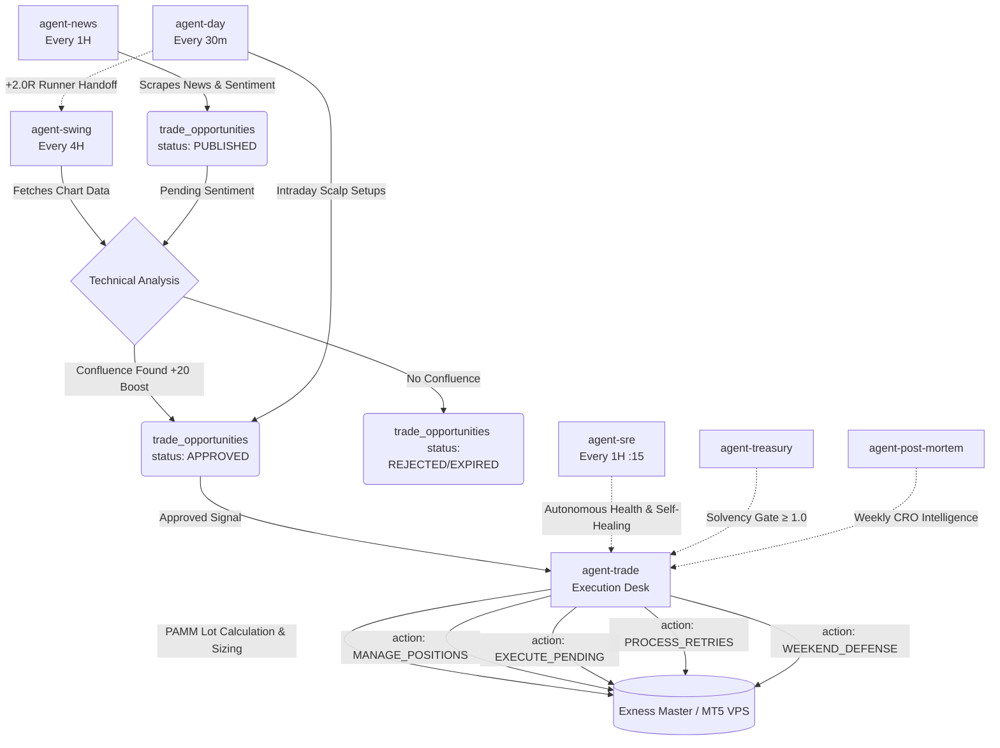

# Multi-Agent AI Trading Architecture
## RaineInvest — Optimum Agent Council Design

---

## The Core Architecture

The RaineInvest automated trading system operates via a highly decoupled, multi-agent council. Rather than one monolithic AI making impulsive decisions, we employ specialized agents that handle distinct layers of the trade lifecycle (Macro Sentiment, Technical Confluence, Risk & Execution, and Position Management). 

The agents communicate exclusively through a shared intelligence layer (the `trade_opportunities` and `user_trades` tables). No agent places a trade directly in the broker without the consensus of the council.

### Zero-Latency MT5 VPS Execution
The actual trade execution and data pushing is handled by the **Zero-Latency MT5 VPS Execution Architecture**, which serves as the primary source of truth (with MetaAPI acting as a failover). 
- **Master EA Setup:** The `RaineInvestEA` is designed as a "Master" Expert Advisor. Even though it is attached to only 1 chart (e.g. `XAUUSD`), it autonomously loops through the entire MT5 Market Watch list. It pushes real-time data to `market_data_pti` and executes pending signals for all symbols. Having it on just 1 chart is the correct and most efficient setup to prevent duplicate executions and minimize CPU load.

---

## The Agent Council Pipeline

### 1. `agent-news` (Fundamental Intelligence)
*The Macro Scout.*
- **Timeframe:** Real-time (Scrapes live news via Tavily)
- **Schedule (Cron):** Every Hour (`0 * * * *`)
- **Role:** It monitors global financial news and economic events. It runs the data through OpenAI to calculate sentiment and a confidence score.
- **Action:** If it detects a major macro catalyst (>85% confidence), it **does not** execute a trade. Instead, it queues the bias into the `trade_opportunities` table under the `PUBLISHED` status.

### 2. `agent-day` (Intraday Scalper)
*The Day Trader.*
- **Timeframe:** 30m / 5m (Focuses on intraday pivot setups and immediate momentum)
- **Schedule (Cron):** Every 30 Minutes (`*/30 * * * *`)
- **Role:** It evaluates fast intraday opportunities, attempting to scalp early entries based on MACD and HTF Pivot Regimes.
- **Action:** 
  - Generates fast `APPROVED` setups when strict intraday conditions are met.
  - **Runner Handoff:** If an `agent-day` scalp hits +2.0R, it autonomously moves the Stop Loss to Break-Even and transfers ownership to `agent-swing`, escalating the quick scalp into a macro swing trade.

### 3. `agent-swing` (Technical Confluence)
*The Swing Trader.*
- **Timeframe:** 4H / 1D (Focuses on Fibonacci structures and liquidity sweeps)
- **Schedule (Cron):** Every 4 Hours (`0 */4 * * *`) — Aligned with H4 candle closes
- **Role:** It performs the technical heavy lifting. It fetches live chart data, maps Fibonacci retracement levels, and looks for liquidity sweeps. 
- **Action:** While evaluating the charts, it sweeps the database for any `PUBLISHED` news from `agent-news`. 
  - **Confluence Boost:** If the technical structure aligns perfectly with the pending news sentiment, it applies a massive +20 confidence boost, merges the signals, and flags the setup as `APPROVED`. 
  - **Penalty:** If the technicals contradict the news, it applies a heavy penalty (-30).
  - If no news is pending, it evaluates purely on technicals.

### 4. `agent-trade` (Unified Chief Risk Officer & Execution Desk)
*The Chief Risk Officer (CRO) & Execution Desk.*
- **Schedule (Cron):** Fast Event Trigger (instant on `APPROVED` signal) & Polling (`3-59/5 * * * *`), with Position Management every 30m (`*/30 * * * *`) and Weekend Defense every Friday (`30 20 * * 5`).
- **Role:** The unified execution hub and risk guardian. It sweeps the database for `APPROVED` setups generated by the council, enforces portfolio-level risk limits, calculates individualized PAMM lots, executes orders, and manages all live and pending trades.
- **Actions:** 
  - **Multi-Agent Confluence:** Scans the last 4 hours of intelligence from all agents. If multiple agents (e.g., `agent-day` and `agent-swing`) signal the same direction, it applies a **3.0x conviction multiplier** to the trade size. If they contradict, it applies a **0.5x penalty**.
  - **Correlation Check:** Prevents opening trades that conflict with existing open positions (e.g., longing EURUSD while already short GBPUSD).
  - **PAMM Lot Allocation:** Dynamically calculates per-user lot sizes based on `user_risk_settings` (Portfolio Capital, Risk %, Daily Drawdown limits, Blowout protections, and PHM rules) and aggregates them into a consolidated master order (`totalMasterVolume`).
  - **Trailing Stops & Position Management (`action: MANAGE_POSITIONS`):** Moves Stop Loss to Break-Even at +0.5R, and trails runner positions dynamically based on ATR.
  - **Pending Order Engine (`action: EXECUTE_PENDING`):** Monitors pending limit/stop orders against live market candles and dispatches to MT5 VPS or broker.
  - **Broker Retry Worker (`action: PROCESS_RETRIES`):** Manages exponential backoff retries with dead-letter isolation.
  - **Defensive Ejections (`action: AUTO_EJECT` & `WEEKEND_DEFENSE`):** Liquidates invalid setups and sweeps losing positions before Friday market close.

### 5. `agent-treasury` (Treasury Desk & Solvency Engine)
*The Fund Comptroller.*
- **Schedule:** Automated Periodic Snapshots, Webhooks & On-Demand Sync.
- **Role:** Calculates the aggregate Solvency Ratio (Assets / Liability), syncs Exness master equity, clears pending customer deposits, and executes broker PAMM internal transfers with full audit logging.

### 6. `agent-post-mortem` (Intelligence & CRO Weekly Analytics)
*The Post-Mortem Auditor & Brand Amplifier.*
- **Schedule:** Weekly Cron / Executive Invocation.
- **Role:** Calculates 7-day net R-multiples and win-rates, evaluates Shadow Ledger predictive accuracy against historical 1h candles, triggers GPT-4o institutional CRO risk reflection, and pushes pre-formatted performance reports to Telegram.

### 7. `agent-sre` (Site Reliability Engineer & Autonomous Watchdog)
*The Autonomous SRE Watchdog.*
- **Schedule (Cron):** Every Hour at `:15` (`15 * * * *`).
- **Role:** Continuously inspects 7 critical subsystem probes (Cron health, HTTP network errors, Agent crashes, Trade desyncs, MT5 VPS heartbeats, Candle freshness, Treasury solvency). Auto-heals desynced trades, garbage-collects stale orders, and enforces the emergency global circuit breaker (`GLOBAL_ABORT`).

---

## Signal Lifecycle Flow

---

## Why This Architecture Wins

The single biggest edge of institutional trading desks over retail traders is their **structured disagreement process**. A junior analyst brings a trade idea. A macro strategist checks the economic regime. A risk manager checks portfolio exposure. Only after surviving that council does the trade reach the execution desk.

Our multi-agent system mirrors this institutional flow. By forcing `agent-news` and `agent-swing` to seek confluence, we eliminate pure-sentiment whipsaws and pure-technical traps, heavily protecting portfolio capital.

> ⚠️ *This is a live system design blueprint. All automated trading involves risk. This system does not guarantee profits. Maintain human oversight of all automated algorithms.*
