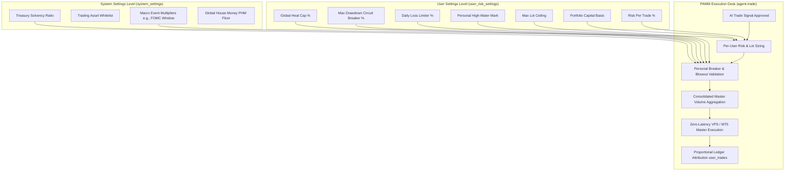
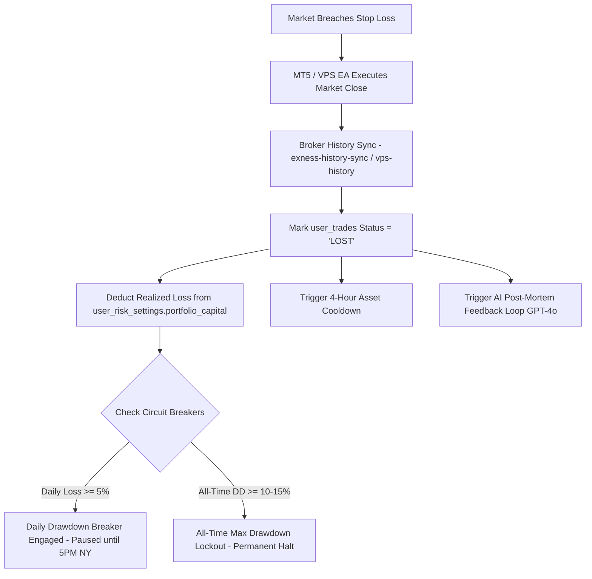

# PAMM Risk Management & Capital Calibration Guide
## RaineInvest — Institutional Sizing & Gating Architecture

---

## 1. Overview: The Dual-Layer Risk Architecture

RaineInvest operates a **hybrid multi-tenant PAMM (Percent Allocation Management Module)**. To balance institutional pooling efficiency with individualized investor safety, risk is partitioned into two distinct control layers:



---

## 2. User Settings Level (`user_risk_settings`)

Each investor or vault participant has an independent record in the `user_risk_settings` table. These parameters isolate each account's risk appetite:

| Parameter | Type | Default | Description |
| :--- | :--- | :--- | :--- |
| `portfolio_capital` | `numeric` | `10000` | The exact dollar capital basis allocated to the PAMM pool. |
| `risk_per_trade_pct` | `numeric` | `0.02` (2%) | Target risk fraction per single setup (clamped between `0.001` and `0.20`). |
| `max_portfolio_heat_pct` | `numeric` | `0.08` (8%) | Maximum cumulative exposure across all concurrent open positions. |
| `max_drawdown_pct` | `numeric` | `0.15` (15%) | All-time drawdown threshold relative to the user's High-Water Mark. |
| `max_daily_drawdown_pct` | `numeric` | `0.05` (5%) | Maximum intraday loss threshold relative to the 5 PM NY baseline equity. |
| `high_water_mark_equity` | `numeric` | `0` | Tracks peak equity. Resetting updates baseline to current capital. |
| `daily_starting_equity` | `numeric` | `0` | Snapshot of capital at 5:00 PM NY reset cycle. |
| `max_volume_per_trade` | `numeric` | `0.05` | Hard lot speed limit on physical trade volume per position. |
| `max_spread_points` | `numeric` | `50` | Maximum allowable broker spread before aborting order dispatch. |
| `auto_trade_enabled` | `boolean` | `true` | Enables/pauses automated PAMM routing for this user. |
| `is_live_execution_enabled`| `boolean` | `true` | Routes trades to live broker (vs. paper trading sandbox). |

---

## 3. System Settings Level (`system_settings`)

Platform-wide safety and macro rules apply globally across all accounts before individual allocations are evaluated:

| Key | Description & Mechanism |
| :--- | :--- |
| `treasury_status` | **Broker Solvency Lockout**: Evaluates `solvency_ratio` (Master Broker free margin vs aggregate user wallet liabilities). If `solvency_ratio < 1.0` or `is_solvent = false`, all automated execution is instantly blocked. |
| `trading_symbols` | **Asset Whitelist**: Array of active instruments approved for AI trade scanning (`EURUSD`, `GBPUSD`, `XAUUSD`, `BTCUSD`, `UKOIL`, etc.). |
| `fomc_window_active` | **Macro Volatility Multiplier**: When central bank/rate events are active (±90 min pre-event / 6h post-event), applies a `1.5x` sizing factor while respecting all hard safety caps. |
| `phm_settings` | **Pyramiding with House Money (PHM)**: Escalates risk dynamically when a user's balance surpasses a predefined profit floor, locking in the floor equity. |

---

## 4. PAMM Lot Sizing Math & Calibration

### 4.1 The Core Sizing Formula
For each active user in the PAMM, the allocated position volume is computed as:

$$\text{Risk Amount (\USD)} = \text{portfolio\_capital} \times \text{risk\_per\_trade\_pct} \times M_{\text{confluence}} \times M_{\text{tier}} \times M_{\text{prob}} \times M_{\text{fomc}}$$

$$\text{Points At Risk} = |\text{Entry Price} - \text{Stop Loss}|$$

$$\text{Calculated Volume (Lots)} = \frac{\text{Risk Amount}}{\text{Points At Risk} \times \text{Point Value per Lot}}$$

### 4.2 Sizing Modifiers
* **Multi-Agent Confluence ($M_{\text{confluence}}$)**: `3.0x` for multi-agent alignment within a 4-hour window; `0.5x` for counter-trend/opposing signals.
* **Signal Tier ($M_{\text{tier}}$)**: `1.0x` for S-Tier / A-Tier; `0.5x` for B-Tier (autopilot defaults to S/A tiers only).
* **Calibrated Probability ($M_{\text{prob}}$)**: `0.75x` if $P(\text{win}) < 50\%$; `0.50x` (with runner leg disabled) if $P(\text{win}) < 45\%$.
* **FOMC Macro Expansion ($M_{\text{fomc}}$)**: `1.5x` during high-impact rate catalyst regimes.

---

## 5. Capital Calibration: Working with the 0.01 MT5 Minimum Lot

MetaTrader 5 enforces a strict minimum order volume of **0.01 lots**. On small accounts, the fixed pip value of 0.01 lots creates a lower boundary on dollar risk.

### 5.1 $500 Account Calibration Matrix

| Asset | Contract Size | Typical SL | 0.01 Lot Risk | Optimal Risk Setting | Notes |
| :--- | :--- | :--- | :--- | :--- | :--- |
| **EURUSD / GBPUSD** | 100,000 | 20 – 30 pips | **$2.00 – $3.00** | `0.02` (2% = $10) | Sized at ~0.03 – 0.04 lots cleanly. |
| **XAUUSD (Gold)** | 100 oz | $4.00 – $7.00 | **$4.00 – $7.00** | `0.02` (2% = $10) | Sized at 0.01 – 0.02 lots without rounding. |
| **BTCUSD (Crypto)** | 1 BTC | $500 – $800 | **$5.00 – $8.00** | `0.02` (2% = $10) | Executes at exactly 0.01 lot. |
| **UKOIL (Crude)** | 1,000 bbl | $0.50 – $0.80 | **$5.00 – $8.00** | `0.02` (2% = $10) | Executes at exactly 0.01 lot. |

### 5.2 Recommended Presets by Account Size

```
┌───────────────────────────┬─────────────────────────┬─────────────────────────┬─────────────────────────┐
│ Metric                    │ $500 Account            │ $2,500 Account          │ $10,000+ Account        │
├───────────────────────────┼─────────────────────────┼─────────────────────────┼─────────────────────────┤
│ Portfolio Capital         │ 500                     │ 2500                    │ 10000                   │
│ Risk Per Trade (%)        │ 0.020 (2.0%)            │ 0.015 (1.5%)            │ 0.010 (1.0%)            │
│ Target Dollar Risk        │ $10.00 / trade          │ $37.50 / trade          │ $100.00 / trade         │
│ Global Portfolio Heat     │ 0.08 (8.0%)             │ 0.06 (6.0%)             │ 0.05 (5.0%)             │
│ Max Drawdown Breaker      │ 0.15 (15.0%)            │ 0.10 (10.0%)            │ 0.08 (8.0%)             │
│ Daily Drawdown Limiter    │ 0.05 (5.0%)             │ 0.04 (4.0%)             │ 0.03 (3.0%)             │
│ Max Volume (Lot Cap)      │ 0.05 Lots               │ 0.25 Lots               │ 1.00 Lots               │
└───────────────────────────┴─────────────────────────┴─────────────────────────┴─────────────────────────┘
```

---

## 6. Circuit Breakers & Blowout Protection

1. **All-Time Max Drawdown Breaker**:
   $$\text{Current Capital} < \text{High-Water Mark} \times (1 - \text{max\_drawdown\_pct})$$
   When breached, the user's volume allocation is set to `0` until manually reset via Vault Settings.
2. **Daily Drawdown Breaker (Prop Firm Protection)**:
   $$\text{Current Capital} < \text{Daily Starting Equity} \times (1 - \text{max\_daily\_drawdown\_pct})$$
   Pauses new allocations until the automated 5:00 PM NY reset cycle.
3. **10% Account Blowout Hard Floor**:
   If a high-volatility stop loss distance would cause even a minimum 0.01 lot position to risk $> 10\%$ of the user's capital, the order is **automatically rejected** to prevent margin calls.
4. **Master Volume Aggregation**:
   $$\text{totalMasterVolume} = \sum_{u \in \text{Qualified Users}} \text{volume}_u$$
   The single consolidated `totalMasterVolume` is sent to the MT5 Master EA / MetaAPI. If `totalMasterVolume <= 0`, trade execution is bypassed.

---

## 7. The Stop-Loss Execution & Post-Stop Lifecycle

When an active position reaches its stop loss in the live market, the system executes an automated, multi-step containment and learning sequence:



### 7.1 Detailed Lifecycle Stages

1. **Broker Execution (Zero-Latency Local Close)**:
   The Stop Loss resides natively on the MT5 broker terminal as a hard order. When price touches the stop, the broker executes the closing fill immediately, eliminating server round-trip latency.
2. **Ledger & Capital Attribution (`exness-history-sync` / `vps-history`)**:
   - The sync worker detects the `DEAL_ENTRY_OUT` closing deal.
   - The corresponding `user_trades` record is updated to `status = 'LOST'`, recording the exact `profit_usd`, `close_price`, and `closed_at` timestamp.
   - The realized loss is debited from `user_risk_settings.portfolio_capital`.
   - The parent `trade_opportunities` record is reconciled to `LOST` with its final negative R-multiple.
3. **Consecutive Stop-Loss Quarantine Cooldown (`agent-risk.ts`)**:
   - Any stopped-out symbol enters a mandatory **4-hour quarantine cooldown**.
   - `validateGlobalSignal` blocks any new signal generation for that symbol if a loss occurred within the last 4 hours (`gte("closed_at", fourHoursAgo)`), preventing knife-catching or revenge trading during volatile regimes.
4. **AI Post-Mortem Feedback Loop (`resolve-outcomes` / `agent-post-mortem`)**:
   - For every trade closing with `LOST` status, the system passes the last 10 candles prior to the stop loss to an LLM evaluator (GPT-4o).
   - The model diagnoses whether the failure was technical noise, premature entry, or structural invalidation, and appends a reflection summary to `trade_opportunities.ai_summary` to calibrate future signal filters.

---

## 8. Multi-Tiered Defense & Guardrail Inventory

The platform employs a **3-Tier Defense Architecture** to safeguard pooled and individual capital against cascading losses:

### Layer 1: Pre-Execution & Signal Guards (Gating & Sizing)

| Guard | Code Reference | Description & Mechanism |
| :--- | :--- | :--- |
| **Strict Asset Isolation** | [`packages/strategy/agent-risk.ts`](file:///Users/quagrained/workspace/raine/invest/packages/strategy/agent-risk.ts#L42-L56) | Enforces 1 active trade per symbol. Rejects duplicate entries unless an existing position is $>0.50\text{ ATR}$ in profit (pyramiding capacity capped at 2). |
| **Dynamic Correlation Limits** | [`supabase/functions/agent-trade/index.ts`](file:///Users/quagrained/workspace/raine/invest/supabase/functions/agent-trade/index.ts#L1641-L1680) | Categorizes assets into correlation groups (`USD`, `EQUITY_INDICES`, `PRECIOUS_METALS`). Blocks opposing trades on correlated pairs and reduces sizing by $50\%$ ($0.5\times$) if correlated exposure already exists. |
| **10% Account Blowout Protection** | [`supabase/functions/agent-trade/index.ts`](file:///Users/quagrained/workspace/raine/invest/supabase/functions/agent-trade/index.ts#L1845-L1878) | If a single position's stop loss distance would risk $>10\%$ of user capital at minimum lot (0.01), the order is either pulled deeper into structural discount limits or rejected outright. |
| **Global Heat Cap** | [`packages/strategy/agent-risk.ts`](file:///Users/quagrained/workspace/raine/invest/packages/strategy/agent-risk.ts#L171-L209) | Blocks new orders if cumulative open risk across all active trades exceeds `max_portfolio_heat_pct` (default **8%**). |
| **Dynamic ATR Stop Floor & Spread Buffers** | [`supabase/functions/agent-trade/index.ts`](file:///Users/quagrained/workspace/raine/invest/supabase/functions/agent-trade/index.ts#L1347-L1498) | Enforces minimum stop distances ($\ge 1.0\times\text{ATR}$ for day trades, $\ge 1.25\times\text{Daily ATR}$ for swing trades) plus asset-specific spread buffers to eliminate noise and spread hunting. |
| **Time of Day Kill Zone Filter** | [`supabase/functions/agent-trade/index.ts`](file:///Users/quagrained/workspace/raine/invest/supabase/functions/agent-trade/index.ts#L1308-L1320) | Blocks automated intraday execution during low-volume Asian sessions (22:00–06:00 UTC), bypassed only for macro swing setups. |
| **Order Flow & Volume Surge Guard** | [`supabase/functions/agent-trade/index.ts`](file:///Users/quagrained/workspace/raine/invest/supabase/functions/agent-trade/index.ts#L1500-L1526) | Rejects breakout orders if tick volume is anemic ($<0.70\times-0.80\times$ baseline volume ratio). |
| **Treasury Solvency Lockout** | [`supabase/functions/agent-trade/index.ts`](file:///Users/quagrained/workspace/raine/invest/supabase/functions/agent-trade/index.ts#L1688-L1698) | Blocks all trade routing if Master Broker free margin is insufficient to cover aggregate customer liabilities (`solvency_ratio < 1.0`). |

### Layer 2: Active Intra-Trade Protection (Position Management)

| Guard | Code Reference | Description & Mechanism |
| :--- | :--- | :--- |
| **Dynamic Trailing Ladder** | [`supabase/functions/agent-trade/index.ts`](file:///Users/quagrained/workspace/raine/invest/supabase/functions/agent-trade/index.ts#L1160-L1204) | • **$\ge +0.50\text{R}$ Move**: Moves SL to **Break-Even (0.0R)**.<br>• **$\ge +1.00\text{R}$ Move**: Locks in **$+0.50\text{R}$**.<br>• **$\ge +2.00\text{R}$ Move**: Locks in **$+1.00\text{R}$**.<br>• **$\ge +3.00\text{R}$ Move**: Locks in **$+2.00\text{R}$**.<br>• **Runner Leg**: Continually trailed at $1.5\times\text{ATR}$. |
| **Companion Breakeven Lock** | [`supabase/functions/exness-history-sync/index.ts`](file:///Users/quagrained/workspace/raine/invest/supabase/functions/exness-history-sync/index.ts#L159-L213) | When the companion `QUICK_EXIT` leg cashes out at $1.0\text{R}$, the companion `RUNNER` stop loss is automatically moved to Break-Even on MT5. |
| **AI Auto-Eject / Invalidation** | [`supabase/functions/agent-trade/index.ts`](file:///Users/quagrained/workspace/raine/invest/supabase/functions/agent-trade/index.ts#L316-L374) | If an opposing high-conviction macro signal appears or setup status degrades, the `Position Manager` closes the open position before the stop-loss level is reached. |
| **20-Bar Horizon Decay (TTL)** | [`supabase/functions/agent-trade/index.ts`](file:///Users/quagrained/workspace/raine/invest/supabase/functions/agent-trade/index.ts#L1195-L1202) | If a position lingers for 20 candles without reaching target, stops are tightened to Break-Even to eliminate stagnant risk. |
| **End-of-Day Scalp Liquidation** | [`supabase/functions/agent-trade/index.ts`](file:///Users/quagrained/workspace/raine/invest/supabase/functions/agent-trade/index.ts#L1101-L1120) | Automatically liquidates all 30m scalps at 4:00 PM NY time to eliminate overnight gap/roll-over risk. |
| **Weekend Defense Sweep** | [`supabase/functions/agent-trade/index.ts`](file:///Users/quagrained/workspace/raine/invest/supabase/functions/agent-trade/index.ts#L377-L489) | Sweeps and closes all losing positions before Friday close and moves all profitable trades to Break-Even. |

### Layer 3: Account & Platform-Level Circuit Breakers

1. **Daily Drawdown Circuit Breaker (`max_daily_drawdown_pct = 5%`)**:
   - If cumulative intraday losses reach **5%** of daily starting equity, the execution desk immediately blocks all new order allocations across all symbols until the 5:00 PM NY daily reset cycle.
2. **All-Time Max Drawdown Breaker (`max_drawdown_pct = 10% - 15%`)**:
   - If total capital drops below $\text{High-Water Mark} \times (1 - \text{max\_drawdown\_pct})$, a complete automated execution freeze engages for that user account until manual review/re-activation.
3. **SRE Autonomous Kill Switch / Global Abort (`agent-sre`)**:
   - [`supabase/functions/agent-sre/index.ts`](file:///Users/quagrained/workspace/raine/invest/supabase/functions/agent-sre/index.ts#L100-L114) monitors system telemetry hourly and maintains an emergency `GLOBAL_ABORT` protocol that pauses `auto_trading_enabled` across the entire platform if anomalous execution errors or broker desyncs occur.

---

## 9. Worst-Case Cascade Simulation: All Live Trades Hit Stop Loss

In a scenario where **all currently open live trades simultaneously hit their full initial stop losses** without any prior trailing stop or breakeven activation:

1. **Gross Capital Impact**:
   - Realized dollar losses are deducted proportionally from user wallets in `user_risk_settings`.
   - On a sample $1,500 account with 18 open positions (total gross open risk ~$653), maximum draw would be capped at the sum of individual stop losses.
2. **Immediate Circuit Breaker Triggering**:
   - The **Daily Drawdown Breaker (5%)** trips after the first $75 in losses, halting any new trade execution for the remainder of the day.
   - The **All-Time Max Drawdown Breaker (10%)** trips once drawdown exceeds $150 from High-Water Mark ($1,350 capital floor), locking out further automated risk entirely.
3. **Quarantine & Recovery**:
   - All stopped-out assets enter a **4-hour cooldown quarantine** in `agent-risk.ts`.
   - GPT-4o post-mortems are generated for every failure, analyzing candle structure and market condition to calibrate subsequent algorithmic entries.
