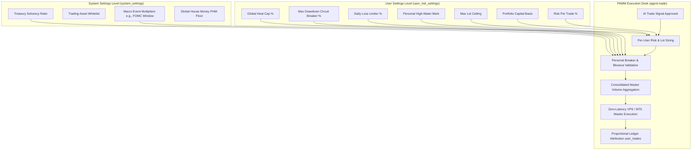

# PAMM Risk Management & Capital Calibration Guide
## Raine Bank — Institutional Sizing & Gating Architecture

---

## 1. Overview: The Dual-Layer Risk Architecture

Raine Bank operates a **hybrid multi-tenant PAMM (Percent Allocation Management Module)**. To balance institutional pooling efficiency with individualized investor safety, risk is partitioned into two distinct control layers:



---

## 2. User Settings Level (`user_risk_settings`)

Each investor or vault participant has an independent record in the `user_risk_settings` table. These parameters isolate each account's risk appetite:

| Parameter | Type | Default | Description |
| :--- | :--- | :--- | :--- |
| `portfolio_capital` | `numeric` | `10000` | The exact dollar capital basis allocated to the PAMM pool. |
| `risk_per_trade_pct` | `numeric` | `0.02` (2%) | Target risk fraction per single setup (clamped between `0.001` and `0.20`). |
| `max_portfolio_heat_pct` | `numeric` | `0.08` (8%) | Maximum cumulative exposure across all concurrent open positions. |
| `max_drawdown_pct` | `numeric` | `0.15` (15%) | All-time drawdown threshold relative to the user's High-Water Mark. |
| `max_daily_drawdown_pct` | `numeric` | `0.05` (5%) | Maximum intraday loss threshold relative to the 5 PM NY baseline equity. |
| `high_water_mark_equity` | `numeric` | `0` | Tracks peak equity. Resetting updates baseline to current capital. |
| `daily_starting_equity` | `numeric` | `0` | Snapshot of capital at 5:00 PM NY reset cycle. |
| `max_volume_per_trade` | `numeric` | `0.05` | Hard lot speed limit on physical trade volume per position. |
| `max_spread_points` | `numeric` | `50` | Maximum allowable broker spread before aborting order dispatch. |
| `auto_trade_enabled` | `boolean` | `true` | Enables/pauses automated PAMM routing for this user. |
| `is_live_execution_enabled`| `boolean` | `true` | Routes trades to live broker (vs. paper trading sandbox). |

---

## 3. System Settings Level (`system_settings`)

Platform-wide safety and macro rules apply globally across all accounts before individual allocations are evaluated:

| Key | Description & Mechanism |
| :--- | :--- |
| `treasury_status` | **Broker Solvency Lockout**: Evaluates `solvency_ratio` (Master Broker free margin vs aggregate user wallet liabilities). If `solvency_ratio < 1.0` or `is_solvent = false`, all automated execution is instantly blocked. |
| `trading_symbols` | **Asset Whitelist**: Array of active instruments approved for AI trade scanning (`EURUSD`, `GBPUSD`, `XAUUSD`, `BTCUSD`, `UKOIL`, etc.). |
| `fomc_window_active` | **Macro Volatility Multiplier**: When central bank/rate events are active (±90 min pre-event / 6h post-event), applies a `1.5x` sizing factor while respecting all hard safety caps. |
| `phm_settings` | **Pyramiding with House Money (PHM)**: Escalates risk dynamically when a user's balance surpasses a predefined profit floor, locking in the floor equity. |

---

## 4. PAMM Lot Sizing Math & Calibration

### 4.1 The Core Sizing Formula
For each active user in the PAMM, the allocated position volume is computed as:

$$\text{Risk Amount (\USD)} = \text{portfolio\_capital} \times \text{risk\_per\_trade\_pct} \times M_{\text{confluence}} \times M_{\text{tier}} \times M_{\text{prob}} \times M_{\text{fomc}}$$

$$\text{Points At Risk} = |\text{Entry Price} - \text{Stop Loss}|$$

$$\text{Calculated Volume (Lots)} = \frac{\text{Risk Amount}}{\text{Points At Risk} \times \text{Point Value per Lot}}$$

### 4.2 Sizing Modifiers
* **Multi-Agent Confluence ($M_{\text{confluence}}$)**: `3.0x` for multi-agent alignment within a 4-hour window; `0.5x` for counter-trend/opposing signals.
* **Signal Tier ($M_{\text{tier}}$)**: `1.0x` for S-Tier / A-Tier; `0.5x` for B-Tier (autopilot defaults to S/A tiers only).
* **Calibrated Probability ($M_{\text{prob}}$)**: `0.75x` if $P(\text{win}) < 50\%$; `0.50x` (with runner leg disabled) if $P(\text{win}) < 45\%$.
* **FOMC Macro Expansion ($M_{\text{fomc}}$)**: `1.5x` during high-impact rate catalyst regimes.

---

## 5. Capital Calibration: Working with the 0.01 MT5 Minimum Lot

MetaTrader 5 enforces a strict minimum order volume of **0.01 lots**. On small accounts, the fixed pip value of 0.01 lots creates a lower boundary on dollar risk.

### 5.1 $500 Account Calibration Matrix

| Asset | Contract Size | Typical SL | 0.01 Lot Risk | Optimal Risk Setting | Notes |
| :--- | :--- | :--- | :--- | :--- | :--- |
| **EURUSD / GBPUSD** | 100,000 | 20 – 30 pips | **$2.00 – $3.00** | `0.02` (2% = $10) | Sized at ~0.03 – 0.04 lots cleanly. |
| **XAUUSD (Gold)** | 100 oz | $4.00 – $7.00 | **$4.00 – $7.00** | `0.02` (2% = $10) | Sized at 0.01 – 0.02 lots without rounding. |
| **BTCUSD (Crypto)** | 1 BTC | $500 – $800 | **$5.00 – $8.00** | `0.02` (2% = $10) | Executes at exactly 0.01 lot. |
| **UKOIL (Crude)** | 1,000 bbl | $0.50 – $0.80 | **$5.00 – $8.00** | `0.02` (2% = $10) | Executes at exactly 0.01 lot. |

### 5.2 Recommended Presets by Account Size

```
┌───────────────────────────┬─────────────────────────┬─────────────────────────┬─────────────────────────┐
│ Metric                    │ $500 Account            │ $2,500 Account          │ $10,000+ Account        │
├───────────────────────────┼─────────────────────────┼─────────────────────────┼─────────────────────────┤
│ Portfolio Capital         │ 500                     │ 2500                    │ 10000                   │
│ Risk Per Trade (%)        │ 0.020 (2.0%)            │ 0.015 (1.5%)            │ 0.010 (1.0%)            │
│ Target Dollar Risk        │ $10.00 / trade          │ $37.50 / trade          │ $100.00 / trade         │
│ Global Portfolio Heat     │ 0.08 (8.0%)             │ 0.06 (6.0%)             │ 0.05 (5.0%)             │
│ Max Drawdown Breaker      │ 0.15 (15.0%)            │ 0.10 (10.0%)            │ 0.08 (8.0%)             │
│ Daily Drawdown Limiter    │ 0.05 (5.0%)             │ 0.04 (4.0%)             │ 0.03 (3.0%)             │
│ Max Volume (Lot Cap)      │ 0.05 Lots               │ 0.25 Lots               │ 1.00 Lots               │
└───────────────────────────┴─────────────────────────┴─────────────────────────┴─────────────────────────┘
```

---

## 6. Circuit Breakers & Blowout Protection

1. **All-Time Max Drawdown Breaker**:
   $$\text{Current Capital} < \text{High-Water Mark} \times (1 - \text{max\_drawdown\_pct})$$
   When breached, the user's volume allocation is set to `0` until manually reset via Vault Settings.
2. **Daily Drawdown Breaker (Prop Firm Protection)**:
   $$\text{Current Capital} < \text{Daily Starting Equity} \times (1 - \text{max\_daily\_drawdown\_pct})$$
   Pauses new allocations until the automated 5:00 PM NY reset cycle.
3. **10% Account Blowout Hard Floor**:
   If a high-volatility stop loss distance would cause even a minimum 0.01 lot position to risk $> 10\%$ of the user's capital, the order is **automatically rejected** to prevent margin calls.
4. **Master Volume Aggregation**:
   $$\text{totalMasterVolume} = \sum_{u \in \text{Qualified Users}} \text{volume}_u$$
   The single consolidated `totalMasterVolume` is sent to the MT5 Master EA / MetaAPI. If `totalMasterVolume <= 0`, trade execution is bypassed.
